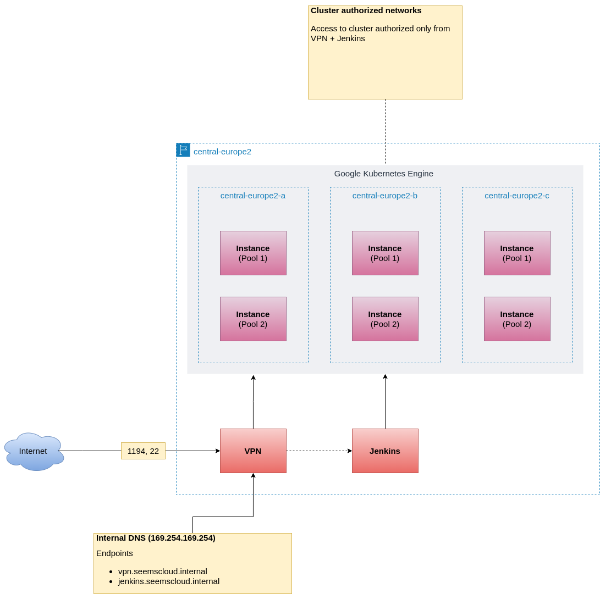

# Take Home

## Architecture

### Diagram



### Cluster

#### Authorized networks

```bash
172.18.0.0 255.255.255.240 (172.18.0.0/28)
```

#### Cluster CIDR

````bash
10.52.0.0/14
````

#### Service CIDR

````bash
10.42.0.0/18
````